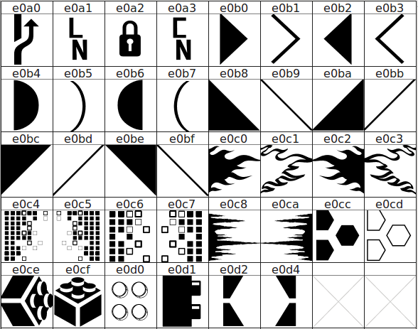

> Extra glyphs for your Powerline separators

These glyphs are now available in the patched fonts from: [Nerd Fonts](https://github.com/ryanoasis/nerd-fonts)


_NOTE: This repo will soon probably just hold the glyphs._

Vim preview also showing column number glyph:


* `vimrc` settings to achieve the above:
  ```vim
  " testing extra-powerline-symbols

  " set font terminal font or set gui vim font
  " to a Nerd Font (https://github.com/ryanoasis/nerd-fonts):
  set guifont=DroidSansMono\ Nerd\ Font\ 12

  " testing rounded separators (extra-powerline-symbols):
  let g:airline_left_sep = "\uE0B4"
  let g:airline_right_sep = "\uE0B6"

  " set the CN (column number) symbol:
  let g:airline_section_z = airline#section#create(["\uE0A1" . '%{line(".")}' . "\uE0A3" . '%{col(".")}'])
  ```

This prompt is on fiiire (flaming shell), just having some fun:


# Glyphs



# Sample Configurations

Example configuration I have for [Banga's powerline-shell](https://github.com/banga/powerline-shell)

```py
        # original
        'patched': {
                'lock': u'\uE0A2',
                'network': u'\uE0A2',
                'separator': u'\uE0B0',
                'separator_thin': u'\uE0B1'
        },
        # angly 1
        'patched': {
                'lock': u'\uE0A2',
                'network': u'\uE0A2',
                'separator': u'\uE0B8',
                'separator_thin': u'\uE0B9'
        },
        # angly 2
        'patched': {
        	'lock': u'\uE0A2',
        	'network': u'\uE0A2',
        	'separator': u'\uE0BC',
        	'separator_thin': u'\uE0BD'
        },
        # curvy
        'patched': {
        	'lock': u'\uE0A2',
        	'network': u'\uE0A2',
        	'separator': u'\uE0B4',
        	'separator_thin': u'\uE0B5'
        },
        # flames (flamey)
        'patched': {
        	'lock': u'\uE0A2',
        	'network': u'\uE0A2',
        	'separator': u'\uE0C0',
        	'separator_thin': u'\uE0C1'
        },
        # lego (blocky)
        'patched': {
        	'lock': u'\uE0A2',
        	'network': u'\uE0A2',
        	'separator': u'\uE0CE',
        	'separator_thin': u'\uE0CF'
        },
        # pixelated blocks 2 (large) random fade (pixey)
        'patched': {
        	'lock': u'\uE0A2',
        	'network': u'\uE0A2',
        	'separator': u'\uE0C6',
        	'separator_thin': u'\uE0C6'
        }
```

## TODO

* [X] ~~Add more triangles~~
* [ ] Add more other type glyphs
* [ ] Create Powerline symbol only font for `fontconfig`
* [X] ~~Add to more fonts (just testing the included [Droid font](/patched-fonts) for now)~~ see: [Nerd Fonts](https://github.com/ryanoasis/nerd-fonts)
* [X] ~~Add glyph set to patcher and fonts in [Nerd Fonts](https://github.com/ryanoasis/nerd-fonts)~~
