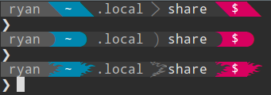
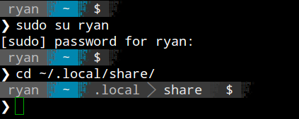
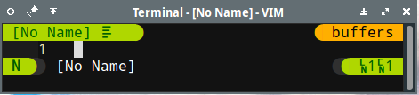
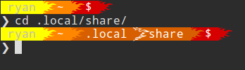
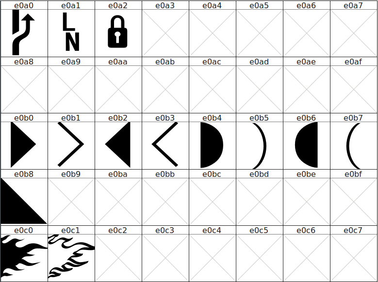

# Powerline Extra Symbols
Extra glyphs for your powerline separators (work in progress)



Attempt at an abstract pixelated faded effect (blocks probably need to be larger):


Vim preview also showing column number glyph:


This prompt is on fiiire (flaming shell), just having some fun:




# Sample Configurations

Example configuration I have for [milkbikis powerline-shell](https://github.com/milkbikis/powerline-shell)

```py
        # original
        'patched': {
            'lock': u'\uE0A2',
            'network': u'\uE0A2',
            'separator': u'\uE0B0',
            'separator_thin': u'\uE0B1'
        },
        # angly
        'patched': {
            'lock': u'\uE0A2',
            'network': u'\uE0A2',
            'separator': u'\uE0B8',
            'separator_thin': u'\uE0B1' # todo
        },
        # curvy
        'patched': {
            'lock': u'\uE0A2',
            'network': u'\uE0A2',
            'separator': u'\uE0B4',
            'separator_thin': u'\uE0B5'
        },
        # flames (flamey)
        'patched': {
            'lock': u'\uE0A2',
            'network': u'\uE0A2',
            'separator': u'\uE0C0',
            'separator_thin': u'\uE0C1'
        },
        # pixelated blocks random fade (pixey)
        'patched': {
            'lock': u'\uE0A2',
            'network': u'\uE0A2',
            'separator': u'\uE0C2',
            'separator_thin': u'\uE0B1'
        },
```

## TODO

* [ ] Add more triangles
* [ ] Add more other type glyphs
* [ ] Add to font patcher
* [ ] Add to more fonts (just testing the included [Droid font](/patched-fonts) for now)
* [ ] Add glyph set to patcher and fonts in [ryanoasis/font-nerd-icons](https://github.com/ryanoasis/font-nerd-icons)
